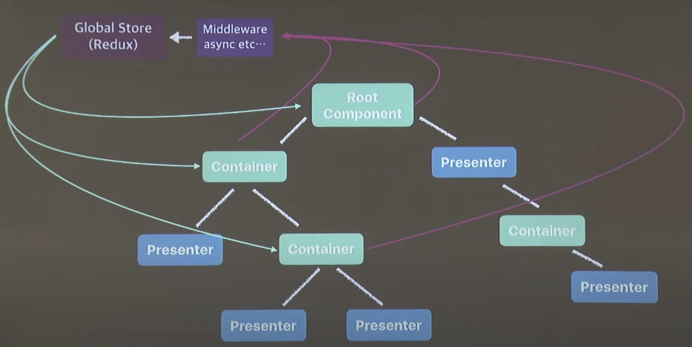
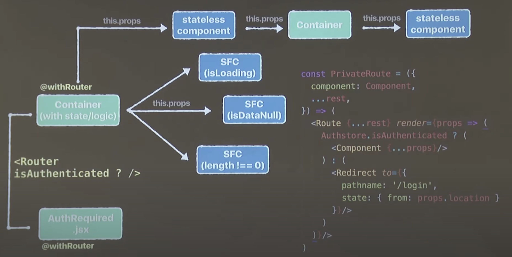
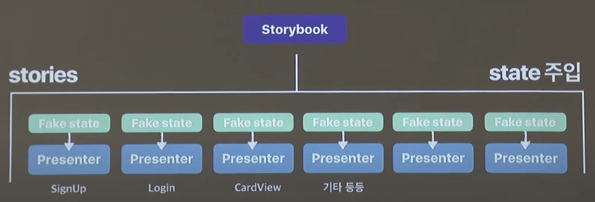

# StroyBook

> StoryBook은 무엇인가?
> [Naver D2 Youtube](https://youtu.be/jc9xKzdkYDg?si=y0yX0fMDbzCbvG3M)

-   StoryBook은 컴포넌트 기반의 view를 위한 UI 컴포넌트 개발환경이다. 
-   React 프로젝트를 진행할 때 tree 구조의 컴포넌트들이 많아짐에 따라 상태 관리의 용이를 위해 Container라는 상태 관리 컴포넌트와 stateless한 pure 컴포넌트를 만들다가 앱의 규모가 커짐에 따라 Container 에서 모든 비즈니스 로직들을 처리하기 힘들 때 전역적인 상태 관리를 위해 상태 관리 라이브러리 등을 사용하게 된다.  
    

-   다만, 상태에 따라 보여지는 stateless 컴포넌트들을 확인하기 위해 상태를 임의로 조작하는 등의 복잡한 과정들을 거쳐야 하는 부분이 있었는데 아래의 이미지처럼 특정 상황에서만 보여지는 컴포넌트의 경우 특정한 상황을 직접 조작하는것이 굉장히 귀찮은 상황도 자주 발생한다. 단순히 컴포넌트 하나를 보기 위해 무수한 노력이 필요한것이다.
      
    
-   StoryBook을 사용하면 pure하고 state에 의존적인 컴포넌트들을 선형적으로 나열하고 언제든지 보고 싶은 컴포넌트들을 볼 수 있게 된다. 또한 fake state를 만들어 특정 상태에 따른 디자인 확인이 용이하다.
      
    
